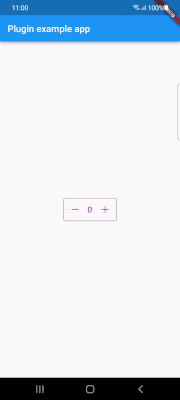
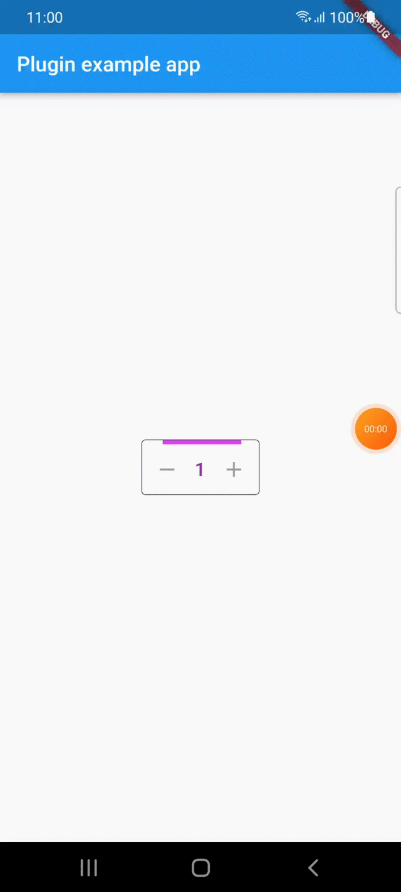

# counter_button

[](https://pub.dartlang.org/packages/counter_button) [](https://github.com/alcohub/counter_button/stargazers) [](https://github.com/alcohub/counter_button/network)  [](https://github.com/alcohub/counter_button/blob/master/LICENSE)  [](https://github.com/alcohub/counter_button/issues)

Counter Button is a flutter library that allows you to create a button with animation effects when you increase or decrease the counter value.

## Screenshots

 

## Installing

```yaml
dependencies:
  counter_button: ^1.0.0
```

### Import

```dart
import 'package:counter_button/counter_button.dart';
```

## How To Use

```dart
CounterButton(
  loading: false,
  onChange: (int val) {
    setState(() {
      _counterValue = val;
    });
  },
  count: _counterValue,
  countColor: Colors.purple,
  buttonColor: Colors.purpleAccent,
  progressColor: Colors.purpleAccent,
)
```


## parameters
| parameter                  | description                                                                           | default                   |
| -------------------------- | ------------------------------------------------------------------------------------- | ------------------------- |
| count                      | Value of the counter                                                                  |                           |
| countColor                 | Color of the counter                                                                  | Colors.black              |
| onChange                   | Value change callback when the buttons are pressed                                    |                           |
| loading                    | For showing the linear progress indicator                                             |                           |
| progressColor              | Color of the progress indicator                                                       | Colors.black              |
| buttonColor                | Color of the icon button                                                              | Colors.black              |
| addIcon                    | Add button icon          |                                                            | const Icon(Icons.add)     |
| removeIcon                 | Remove button icon                                                                    | const Icon(Icons.remove)  |


## Bugs & Requests

If you encounter any bugs feel free to open an issue. Raise a ticket on github for suggestions. Pull request are also welcome.

### Flutter

For help getting started with Flutter, view our online
[documentation](https://flutter.io/).

For help on editing plugin code, view the [documentation](https://flutter.io/platform-plugins/#edit-code).

## License

MIT License
